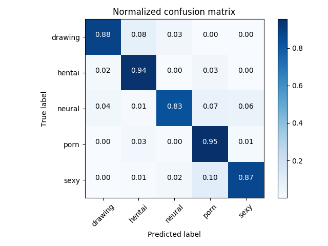
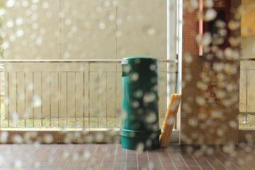
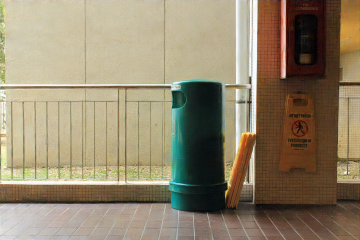
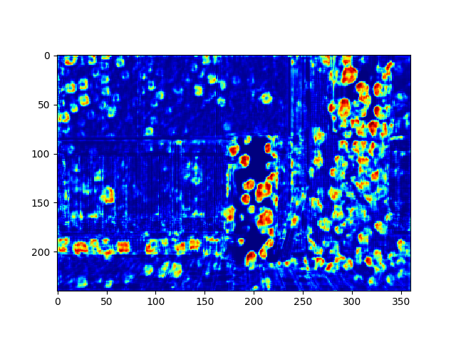
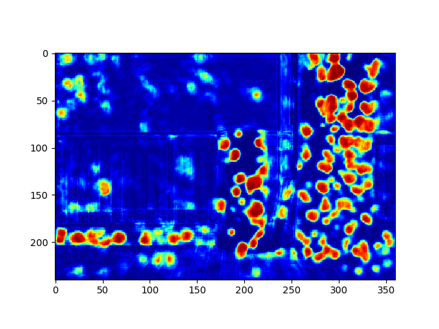
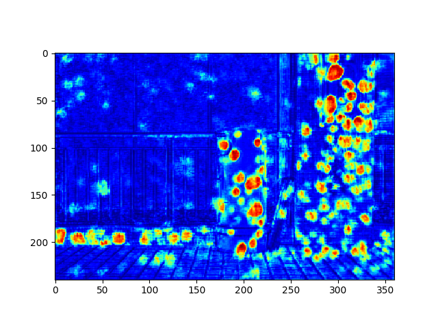
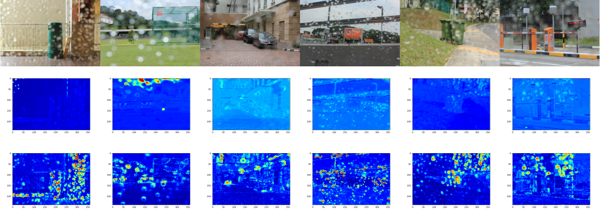

# MaybeShewill-CV.github.io

Here are some of my deep-learning projects which can be showed online. 
You may go to sub folder to test the model

[](https://github.com/ryo-ma/github-profile-trophy)

## Nsfw-Classify-Tensorflow
NSFW classify model implemented with tensorflow. Use nsfw dataset provided here
https://github.com/alexkimxyz/nsfw_data_scraper Thanks for sharing the dataset
with us. You can find all the model details here. Don not hesitate to raise an
issue if you're confused with the model.

### Online demo

##### URL: https://maybeshewill-cv.github.io/nsfw_classification

This software has only been tested on ubuntu 16.04(x64). Here is the test environment
info

**OS**: Ubuntu 16.04 LTS

**GPU**: Two GTX 1070TI 

**CUDA**: cuda 9.0

**Tensorflow**: tensorflow 1.12.0

**OPENCV**: opencv 3.4.1

**NUMPY**: numpy 1.15.1

The main model's hyperparameter are as follows:

**iterations nums**: 160010

**learning rate**: 0.1

**batch size**: 32

**origin image size**: 256

**cropped image size**: 224

**training example nums**: 159477

**testing example nums**: 31895

**validation example nums**: 21266

The rest of the hyperparameter can be found [here](https://github.com/MaybeShewill-CV/nsfw-classification-tensorflow/blob/master/config/global_config.py).

You may monitor the training process using tensorboard tools

During my experiment the `train loss` drops as follows:  


The `train_top_1_error` rises as follows:  


The `validation loss` drops as follows:  


The `validation_top_1_error` rises as follows:  


#### The Model Evaluation 

Some of the evaluation results atr like this 


The model's main evaluation index are as follows:

**Precision**: 0.92406 with average weighted on each class

**Recall**: 0.92364 with average weighted on each class

**F1 score**: 0.92344 with average weighted on each class

The `Confusion_Matrix` is as follows:  


The `Precison_Recall` is as follows:  


#### Online demo

##### URL: https://maybeshewill-cv.github.io/nsfw_classification

Since tensorflo-js is well supported the online deep learning is easy to deploy.
Here I have make a online demo to do local nsfw classification work. The whole js work
can be found here https://github.com/MaybeShewill-CV/MaybeShewill-CV.github.io/tree/master/nsfw_classification
I have supplied a tool to convert the trained tensorflow saved model file into 
tensorflow js model file. In order to generate saved model you can read the 
description about it above. After you generate the tensorflow saved model you 
can simply modify the file path and run the following script

```
cd ROOT_DIR
bash tools/convert_tfjs_model.sh
```
The online demo's example are as follows:


#### TODO
- [ ] Add tensorflow serving script

## Attentive Deraindrop From Single Image
Use tensorflow to implement a Deep Convolution Generative Adversarial 
Network for image derain task mainly based on the CVPR2018 paper 
"attentive Generative Adversarial Network for Raindrop 
Removal from A Single Image".You can refer to their paper for details 
https://arxiv.org/abs/1711.10098. This model consists of a attentive 
attentive-recurrent network, a contextual autoencoder network and a 
discriminative network. Using convolution lstm unit to generate attention 
map which is used to help locating the rain drop, multi-scale losses and 
a perceptual loss to train the context autoencoder network. Thanks for 
the origin author [Rui Qian](https://github.com/rui1996)

### Online demo

##### URL: https://maybeshewill-cv.github.io/attentive_derain_net

For install and training process you may refer [here](https://github.com/MaybeShewill-CV/attentive-gan-derainnet)

### Attentive DerainNet Training Visualization

The test results are as follows:

`Test Input Image`



`Test Derain result image`



`Test Attention Map at time 1`



`Test Attention Map at time 2`


`Test Attention Map at time 3`



`Test Attention Map at time 4`



You may monitor the training process using tensorboard tools

During my experiment the `G loss` drops as follows:  


The `D loss` drops as follows:  


The `Image SSIM between generated image and clean label image` raises as follows:  


`Model result comparision`


The first row is the source test image in folder ./data/test_data, the
second row is the derain result generated by the old model and the last
row is the derain result generated by the new model. As you can see the
new model perform much better than the old model.

Since the bn layer will leads to a unstable result the deeper attention 
map of the old model will not catch valid information which is supposed
to guide the model to focus on the rain drop. The attention map's 
comparision result can be seen as follows.

`Model attention map result comparision`


The first row is the source test image in folder ./data/test_data, the
second row is the attention map 4 generated by the old model and the 
last row is the attention map 4 generated by the new model. As you can 
see the new model catch much more valid attention information than the
old model.

#### TODO
- [ ] Add tensorflow serving script